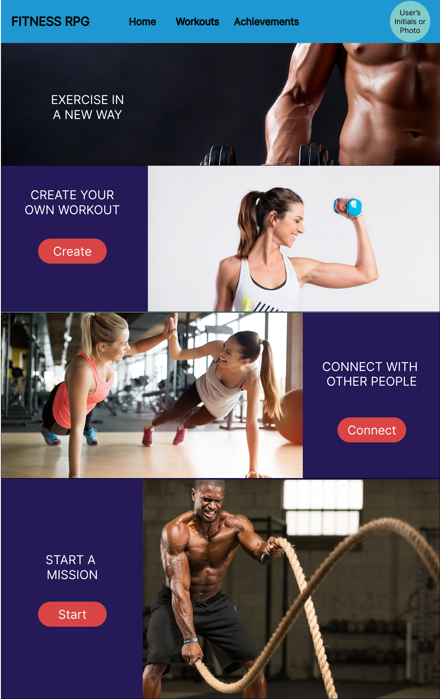
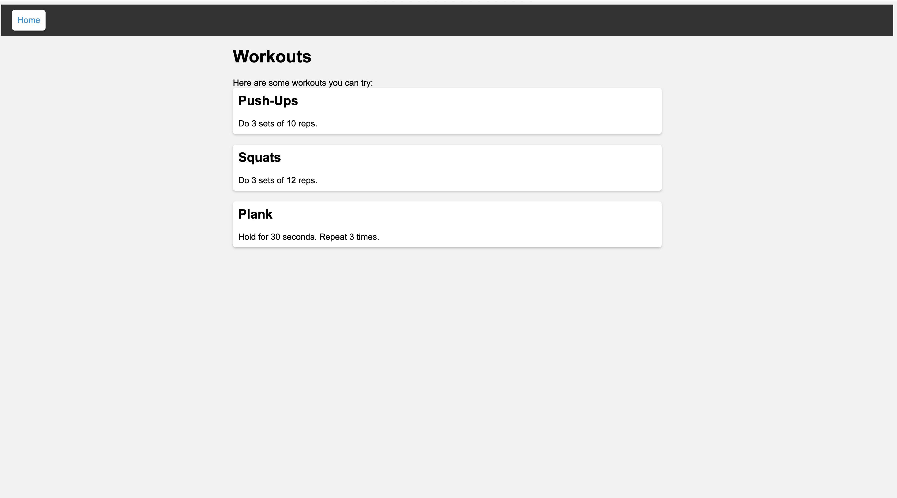

# UI Design

## Wireframe

This wireframe shows the home page of our web application, Fitness RPG. At the top, users can click on home option to get back to the home page, as well as click on the workouts option to view the personalized workouts. In order to fit our theme of an RPG game, there is also an acheivement section, where users can see their challenges and collect rewards. The top right of the homepage includes an area where the profile picture of the user is displayed, in order to create a more personalized feel. A user can click on this in order to bring them to a screen where they can view/update their personal information. On the main body of the home page, there are options for viewers to create their own workout, connect to other users or start their own personally curated workout mission. 

This page shows the different style of challenges a user can get with this app. 
## Stories

### Story 1

Hi, my name is Jake, and I love playing RPG games. I have been into fitness for a while and always looking for new ways to stay motivated. That's when I heard about this Fitness App that combines fitness with gaming, and I was intrigued. I downloaded the app, created my profile, and set up my weight. The app generated a workout plan for me based on my weight and fitness level. The plan was challenging, and I was determined to complete it.

The app had a mission system that rewarded me with coins for every mission completed. The missions were daily challenges like walking a certain number of steps or drinking a certain amount of water. I loved the reward system as it made me feel like I was leveling up in a game. It was satisfying to see my progress and earn coins.

The app also had a chat functionality that allowed me to communicate with other users on the app. I exchanged tips, advice, and encouragement with other users. It was inspiring to see their stories and to be part of a community that shares the same passion for fitness. The app motivated me to keep working out and to stay healthy

### Story 2

Hello, my name is Sophie, and I have been struggling with my weight for a long time. I needed motivation to start working out, and that's when I heard about this Fitness App. I downloaded the app, created my profile, and set up my weight. The app generated a beginner workout plan for me, and I started working out.

The app had a mission system that rewarded me with coins for every mission completed. The missions were simple but challenging enough to keep me motivated. I loved the reward system as it made me feel like I was achieving something. The app also had a feature that allowed me to create a personal workout plan. I created a workout plan that was suited to my fitness level and goals.

The chat functionality allowed me to communicate with other users on the app. I exchanged tips and advice with other users and found their stories inspiring. It was great to be part of a community that shares the same passion for fitness. The app helped me stay motivated and focused on my fitness goals.

### Story 3

Hi, my name is Raj, and I am a fitness coach. I have been looking for an innovative way to motivate my clients, and that's when I heard about this Fitness App. I downloaded the app and recommended it to my clients. I created a community on the app and set up workout plans for my clients.

The app had a mission system that rewarded my clients with coins for every mission completed. The missions were challenging enough to keep my clients motivated. I loved the reward system as it made my clients feel like they were achieving something. The app also had a feature that allowed me to create a personalized workout plan for each of my clients.

The chat functionality allowed me to communicate with my clients on the app. I exchanged tips, advice, and encouragement with them. It was great to be part of a community that shares the same passion for fitness. The app helped me motivate my clients and keep them focused on their fitness goals. I was impressed by how the app combined fitness with gaming, and it was a great tool to help my clients stay motivated.
## HTML & CSS Mockup

Homepage and Worksouts Page below!

Same as the wireframe, this shows the home page!

This shows the workout page displaying the missions a user can potentially get

